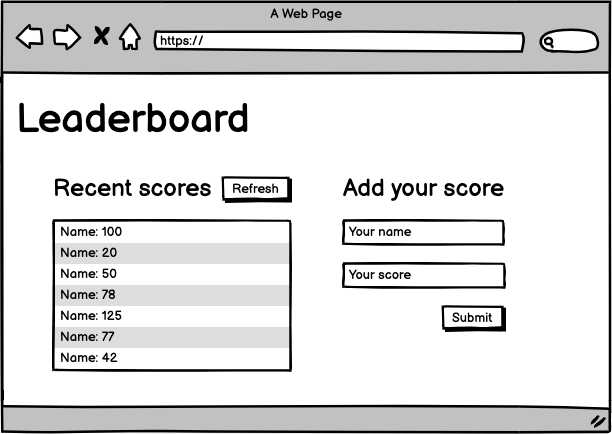

# Leaderboard
The leaderboard website displays scores submitted by different players. It also allows you to submit your score. All data is preserved thanks to the external [Leaderboard API service](https://www.notion.so/microverse/Leaderboard-API-service-24c0c3c116974ac49488d4eb0267ade3).

# Leaderboard

> Website that allows users to add/remove scores from a list, interacting with a remote API.

This is achieved by hitting a remote API. Also, the DOM is dynamically modified with basic events. 

## Built With

- Plain JavaScript
- HTML5
- CSS3
- Webpack

## Future Updates & Roadmap:

- Complete website with styles

## Getting Started:

To get a local copy up and running follow these simple example steps:

1. Under the repository name, click the Clone or download green button.

2. Copy the URL given by clicking the clipboard button

3. Open a terminal window in your local machine and change the current directory to the one you
   want the clone directory to be made.

4. Type  git clone and the paste the URL you previously copied to the clipboard

5. Change the current directory to the newly created folder

6. Now open the index.html file on your browser. You can add and remove books which persist on browser reloads.

## Author

👤 **Alex Gamino**

- Github: [@Alex Gamino](https://github.com/AlexHamn)
- Linkedin: [linkedin](https://linkedin.com/in/alex-gamino-81aab3214/)

## 🤝 Contributing

Contributions, issues and feature requests are welcome!

Feel free to check the [issues page](issues/).

## Show your support

Give a ⭐️ if you like this project!

## 📝 License

This project is [MIT](lic.url) licensed.
